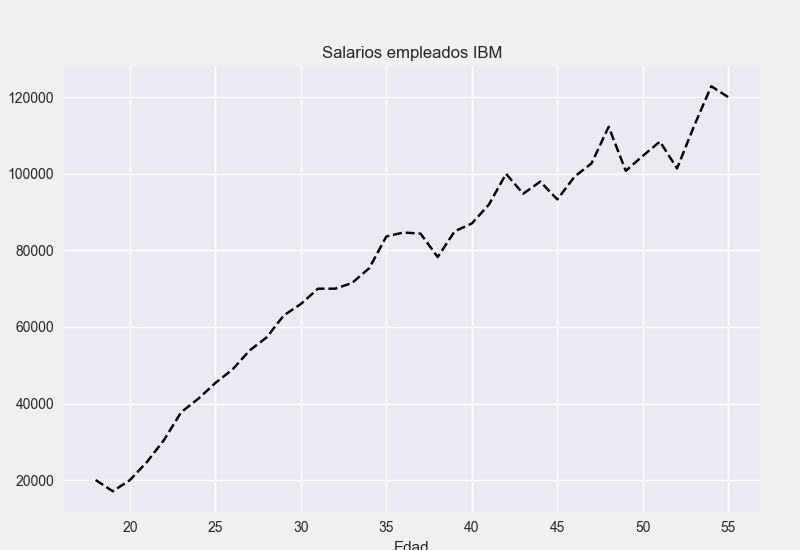
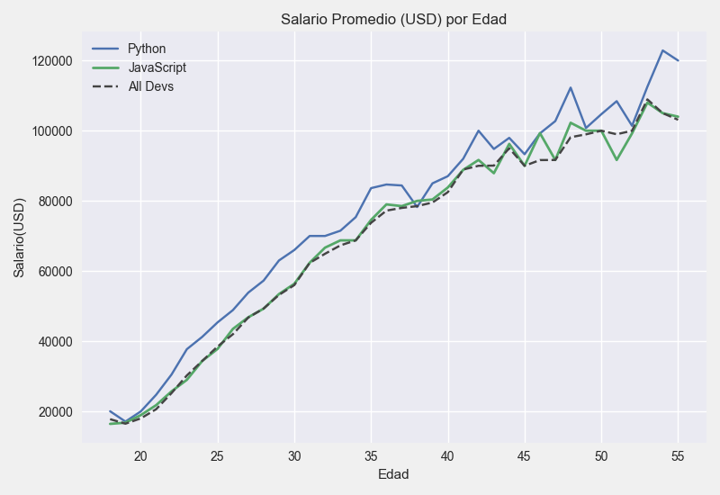

# ESPECIALIZACION_MATPLOTLIB
10 cursos tomados de la serie Matplotlib del profesor Corey Shafer
En esta serie de videos en Youtube se aprenden las tecnicas de visualizacion
para utilizar mejor la libreria Matplotlib de pandas, 
# Graficos de tendencias
   
    
# Graficos de Barras
# Pie Chart o Grafico circular
# Stack plots o grafico de volumen
# Histogramas
# Grafico de dispersion
# Ploting time series, o graficos que se alimentan de info online
# Subplots graficos de Python con la funcion orientada a objetos
